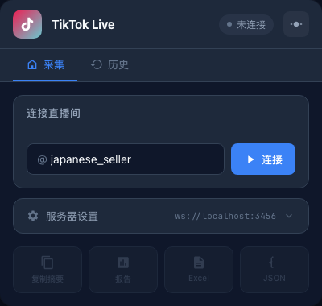
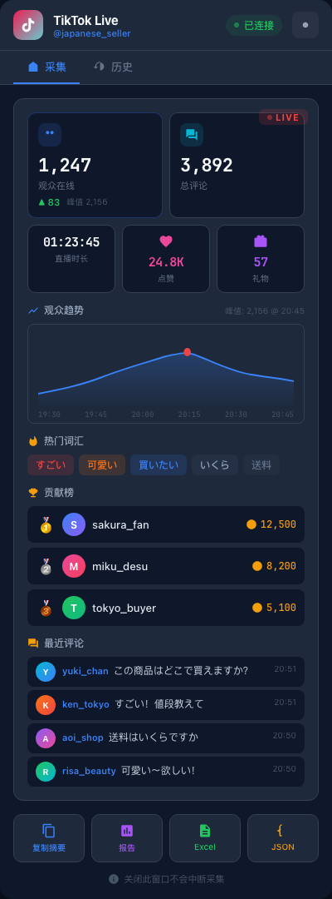
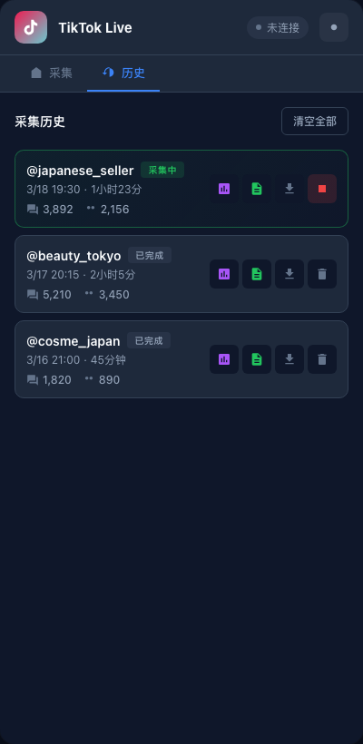

# TikTok Live Analytics / TikTok 直播间分析工具

A Chrome extension + local Node server for real-time TikTok live stream data collection and analysis. Now with e-commerce, red envelopes, PK battles, Q&A, emotes, and VIP barrages.

Chrome 扩展 + 本地 Node 服务器，实时采集 TikTok 直播间数据并分析。v3.0 新增电商、红包、PK 对战、问答、表情、VIP 弹幕等全量事件。

## Table of Contents / 目录

- [Quick Start / 快速开始](#quick-start--快速开始) — **Start here / 从这里开始**
- [Screenshots / 截图](#screenshots--截图)
- [Features / 功能一览](#features--功能一览)
- [Architecture / 架构](#architecture--架构)
- [Development / 开发](#development--开发)
- [Tech Stack / 技术栈](#tech-stack--技术栈)
- [WebSocket Protocol / 协议](#websocket-protocol--websocket-协议)
- [Security / 安全](#security--安全)

## Screenshots / 截图

<table>
<tr>
<td width="33%" align="center">
<strong>Connect / 连接</strong><br><br>
<br><br>
Enter username to start<br>输入用户名开始采集
</td>
<td width="33%" align="center">
<strong>Live Dashboard / 实时面板</strong><br><br>
<br><br>
Real-time stats & charts<br>实时数据与图表
</td>
<td width="33%" align="center">
<strong>History / 采集历史</strong><br><br>
<br><br>
Session management & export<br>会话管理与导出
</td>
</tr>
</table>

### Live Dashboard Details / 实时面板详情

| Feature / 功能 | Description / 说明 |
|---|---|
| **Viewer count** / 观众数 | Real-time count with change indicator (▲/▼) and peak tracking / 实时在线人数，含涨跌指示和峰值追踪 |
| **Comment count** / 评论数 | Accumulated comments in current session / 当前会话累计评论总数 |
| **Duration, Likes, Gifts** / 时长、点赞、礼物 | Compact bento-grid layout with auto-formatted numbers / 紧凑卡片布局，大数字自动缩写（如 24.8K） |
| **Viewer trend** / 观众趋势图 | Incremental line chart with gradient fill, peak marker in red / 增量更新折线图，峰值以红点标记 |
| **Hot keywords** / 热门词汇 | Auto-extracted from comments (debounced), color-coded by frequency / 从评论自动提取高频词（500ms 节流），按频率着色 |
| **Top contributors** / 贡献榜 | Gift leaderboard ranked by coin value / 按打赏金额排序的贡献榜 |
| **Live comments** / 最近评论 | Scrolling feed with avatar, nickname, actual timestamp / 实时评论流，含头像、昵称、实际消息时间 |
| **Export** / 导出 | Copy Summary, HTML Report, Excel, JSON — 4 formats / 复制摘要、HTML 报告、Excel、JSON 四种格式 |

### Session History Details / 采集历史详情

| Feature / 功能 | Description / 说明 |
|---|---|
| **Session cards** / 会话卡片 | Username, start time, duration, comment count, peak viewers / 用户名、开始时间、时长、评论数、峰值观众 |
| **Status badge** / 状态标签 | Green "采集中" (active) or gray "已完成" (completed) / 绿色活跃 / 灰色已完成 |
| **Per-session export** / 按会话导出 | HTML report, Excel (.xlsx), JSON for each session independently / 每个会话独立导出三种格式 |
| **Stop / Delete** / 停止/删除 | Stop active collection or delete completed sessions / 停止采集或删除历史会话 |

## Features / 功能一览

| Category | Feature | Details |
|---|---|---|
| **Data Collection** / 数据采集 | Comments / 评论 | ID, username, nickname, content, timestamp |
| | Gifts / 礼物 | Gift name, repeat count, diamond value |
| | Likes / 点赞 | Like count, total likes |
| | Viewers / 观众 | Real-time count, top viewer leaderboard |
| | Follows, Shares, Subscribes / 关注、分享、订阅 | Event tracking with timestamps |
| | Shopping / 商品推荐 | Product name, price, shop name |
| | Envelopes / 红包 | Sender, diamond count, participants |
| | Questions / 问答 | User questions in Q&A sessions |
| | Battle (PK) / PK 对战 | Battle scores, anchor matchups |
| | Emotes / 表情 | Emote usage tracking |
| | Barrages / VIP 弹幕 | VIP barrage messages with type |
| | Rank / 排名 | Hourly rank and rank updates |
| **Storage** / 存储 | IndexedDB (Dexie.js) | 14 tables (v6), persists across browser restarts / 14 张表（v6），浏览器重启不丢失 |
| **Export** / 导出 | JSON | Full raw data including all event types / 完整原始数据（含全部事件类型） |
| | Excel (.xlsx) | 13 sheets: overview, comments, gifts, viewers, follows, shares, subscribes, shopping, envelopes, Q&A, PK, emotes, barrages / 13 个 Sheet |
| | HTML Report | Self-contained with embedded Chart.js / 自包含 HTML 报告（内嵌图表） |
| | Copy Summary | One-click clipboard / 一键复制摘要 |
| **UI** / 界面 | 4 Tabs | Home (collect), Monetize (gifts/envelopes/shopping/PK), Interact (Q&A/emotes/barrages), History / 采集、变现、互动、历史 |
| | Dark / Light mode | Persistent theme toggle, consistent across all tabs / 深色浅色切换，全 Tab 一致 |
| **Performance** / 性能 | Throttled broadcast | 200ms broadcast throttle, debounced word stats / 200ms 广播节流，热词统计 500ms 防抖 |
| | Incremental chart | ViewerChart updates without rebuild / 观众图表增量更新不闪烁 |
| **Security** / 安全 | Origin validation | localhost + chrome-extension only |
| | Connection limit | Max 10 WS clients / 最多 10 个 WS 连接 |
| | sender.id check | Messages verified from own extension / 验证消息来自本扩展 |
| | Input sanitization | HTML escape + username regex |
| | wsUrl whitelist | ws(s)://localhost or 127.0.0.1 only |
| | Log sanitization | Production logs show action only, no raw data / 生产日志仅打印动作 |

## Quick Start / 快速开始

> **Only need**: [Node.js](https://nodejs.org/) >= 18 + Chrome browser
>
> **只需要**：[Node.js](https://nodejs.org/) >= 18 + Chrome 浏览器

### Option A: One-Click Setup / 方式一：一键部署（推荐）

```bash
git clone https://github.com/yuevthins/tiktok-live-analytics.git
cd tiktok-live-analytics
bash setup.sh
```

The script will automatically:
1. Check your Node.js version / 检查 Node.js 版本
2. Install all dependencies / 安装所有依赖
3. Build the Chrome extension / 构建 Chrome 扩展
4. Start the server / 启动服务器

Then just load the extension in Chrome (the script shows you exactly how).
然后按脚本提示在 Chrome 中加载扩展即可。

### Option B: Download Pre-built Extension / 方式二：直接下载（不需要构建）

1. **Download** the latest `tiktok-live-extension-v*.zip` from [Releases](https://github.com/yuevthins/tiktok-live-analytics/releases)
   从 [Releases 页面](https://github.com/yuevthins/tiktok-live-analytics/releases) 下载最新的 `.zip` 文件

2. **Unzip** it / 解压缩

3. **Start the server** / 启动服务器：
   ```bash
   git clone https://github.com/yuevthins/tiktok-live-analytics.git
   cd tiktok-live-analytics/tiktok-live-server
   npm install
   node server.js
   ```

4. **Load in Chrome** / 在 Chrome 中加载：
   - Open `chrome://extensions/` / 打开 `chrome://extensions/`
   - Enable **Developer mode** (top-right toggle) / 开启右上角「开发者模式」
   - Click **Load unpacked** / 点击「加载已解压的扩展程序」
   - Select the unzipped `chrome-mv3` folder / 选择解压后的 `chrome-mv3` 文件夹

### Start Using / 开始使用

1. Click the TikTok Live icon in Chrome toolbar / 点击工具栏的 TikTok Live 图标
2. Enter a TikTok username (e.g. `japanese_seller`) / 输入用户名
3. Click **Connect** / 点击「连接」
4. Data flows in real-time! Export anytime / 数据实时流入！随时可导出

## Architecture / 架构

```
TikTok Live API
    ↓ (tiktok-live-connector)
Node Server (port 3456)
    ↓ WebSocket
Chrome Extension (MV3)
    ├── Background Service Worker — data collection & buffering
    ├── IndexedDB (Dexie.js) — persistent storage
    └── Popup UI (Vue 3) — real-time display & export
```

## Development / 开发

### Server / 服务器

```bash
cd tiktok-live-server
node server.js          # Start / 启动
npm test                # 15 tests (unit + integration)
```

### Extension / 扩展

```bash
cd tiktok-live-extension
npm run dev             # Dev mode with hot reload / 开发模式
npm run build           # Production build / 生产构建
npm test                # 14 tests
```

## Tech Stack / 技术栈

| Layer / 层 | Technology / 技术 |
|---|---|
| Extension framework | [WXT](https://wxt.dev/) (Chrome MV3) |
| Popup UI | Vue 3 (Composition API) |
| Data storage | [Dexie.js](https://dexie.org/) (IndexedDB) |
| Charts | Chart.js |
| Excel export | [SheetJS](https://sheetjs.com/) (xlsx) |
| Live API | [tiktok-live-connector](https://github.com/zerodytrash/TikTok-Live-Connector) |
| Testing | [Vitest](https://vitest.dev/) |

## WebSocket Protocol / WebSocket 协议

Server → Extension messages:

| type | Description / 说明 |
|---|---|
| `status` | Initial connection status / 初始连接状态 |
| `connected` | Connected to live room / 成功连接直播间 |
| `disconnected` | Disconnected / 断开连接 |
| `error` | Error message / 错误信息 |
| `comment` | Live comment / 直播评论 |
| `gift` | Gift event (on repeatEnd) / 礼物事件 |
| `like` | Like event / 点赞事件 |
| `roomUser` | Viewer count + top viewers / 观众数 + 打赏榜 |
| `follow` / `share` / `subscribe` | User actions / 用户行为 |
| `oecLiveShopping` | Product recommendation / 商品推荐 |
| `envelope` | Red envelope / 红包 |
| `hourlyRank` / `rankUpdate` / `rankText` | Rank events / 排名事件 |
| `questionNew` | Viewer question / 观众提问 |
| `linkMicArmies` | PK battle scores / PK 积分 |
| `linkMicBattle` | PK battle status / PK 对战状态 |
| `emote` | Emote chat / 表情聊天 |
| `barrage` | VIP barrage / VIP 弹幕 |
| `streamEnd` | Stream ended / 直播结束 |

Extension → Server: `{ action: 'connect', username }` / `{ action: 'disconnect' }`

## Security / 安全

| Measure / 措施 | Details / 详情 |
|---|---|
| **Origin validation** / 来源验证 | Only `localhost`, `127.0.0.1`, `chrome-extension://` allowed |
| **Connection limit** / 连接上限 | Max 10 WebSocket clients (prevents local DoS) / 最多 10 个 WS 客户端 |
| **sender.id verification** / 消息来源验证 | `chrome.runtime.onMessage` checks sender is own extension / 验证消息来自本扩展 |
| **Username validation** / 用户名验证 | Strict regex `/^[a-zA-Z0-9_.]{1,24}$/` |
| **wsUrl whitelist** / WS 地址白名单 | Only `ws(s)://localhost` or `ws(s)://127.0.0.1`, no paths |
| **XSS prevention** / XSS 防护 | All user input HTML-escaped before display |
| **Log sanitization** / 日志脱敏 | WS messages logged by action only, no raw content / 仅记录动作类型 |

## License / 许可证

[MIT](LICENSE)
